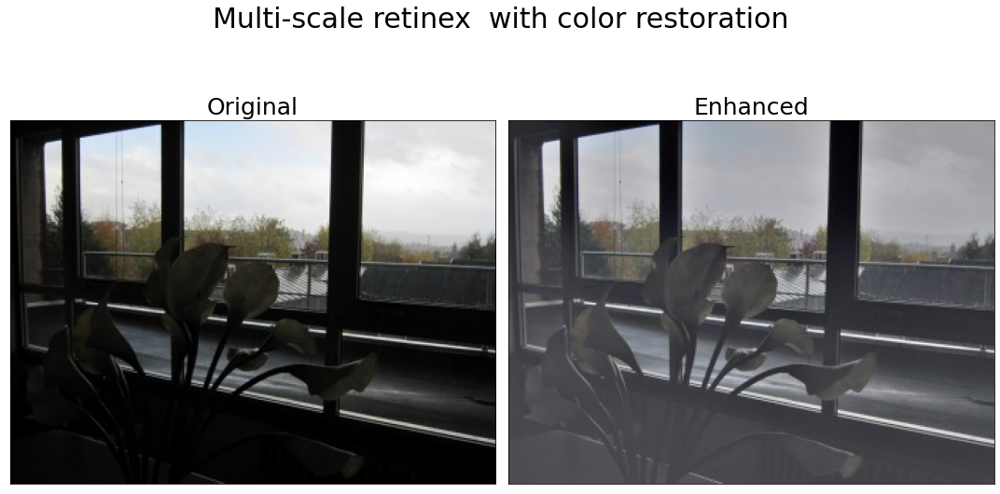

<h1 align="center">retinex</h1> 

    
    

## Motivation

The retinex theory was developed by Land and McCann to model how the human visual system perceives a scene. While exploring more on this attempt by the retinex theory as a part of my course project on image enhancement, I came across this paper on multi-scale retinex that tries to enhance an image with more focus on the color enhancemnt step.

## Results

</img>

 

Read up the [Jupyter notebook](notebook.ipynb) for the usage.

## References

[**1**] Ana Bel´en Petro, Catalina Sbert, Jean-Michel Morel, "Multiscale Retinex" [Paper](https://www.researchgate.net/publication/272643640_Multiscale_Retinex)

[**2**] D. J. Jobson, Z. Rahman and G. A. Woodell, "A multiscale retinex for bridging the gap between color images and the human observation of scenes" [Paper](https://ieeexplore.ieee.org/document/597272/authors#authors)